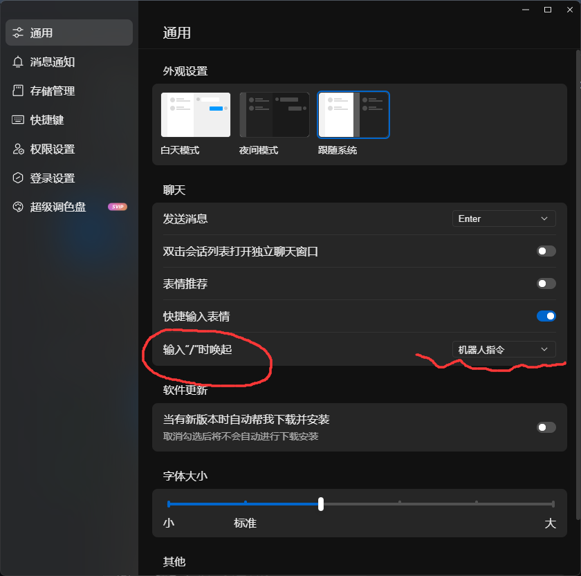

  ```component VPCard
  title: 恋萌萌_5i4
  desc: 点击此卡片来领养恋萌萌
  logo: qq_official.png
  link: https://qun.qq.com/qunpro/robot/qunshare?robot_uin=3889012927&robot_appid=102091267&biz_type=0
  background: rgba(253, 230, 138, 0.15)
  ```

### 当你点击上方卡片跳转到下方图片显示的内容时，再点击下方的蓝色按钮添加到群聊即可

::: important

请确保你是管理员或群主，否则请分享至相应群聊后，让相关管理或群主添加至群聊

::: 


### **在群内聊天框上输入**：```/```来呼出主菜单，有些命令包含子命令，请注意，如```@恋萌萌_5i4 /mai b50```

- 手机端确保你的qq为nt核心且为最新版，在不出意外情况下就可以弹出
- pc端需要设置为输入斜杠唤起机器人指令：


::: caution

官方版因腾讯api的特殊性，反应较无印版慢，且有时图片会发不出（低概率性），请耐心等待或重新发送指令

:::

### 对于舞萌 / 中二 命令，一些查询功能因腾讯官方api的限制缘故，必须通过@恋萌萌 /bind mai 水鱼用户名 方可使用

